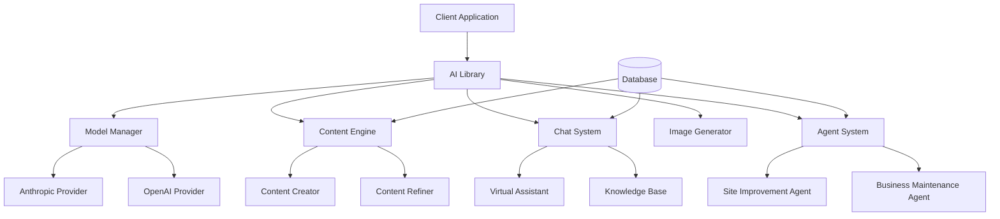

# AI Library Implementation Plan - AI SDK 5 Beta

## Overview

This document outlines the comprehensive implementation plan for building an AI library using AI SDK 5 Beta that will provide content creation, refinement, chat capabilities, image generation, and communication assistance for website management.

## Table of Contents

1. [Installation Documentation](#installation-documentation)
2. [Architecture Overview](#architecture-overview)
3. [Features Overview](#features-overview)
4. [Implementation Phases](#implementation-phases)
5. [Technical Specifications](#technical-specifications)
6. [Configuration](#configuration)
7. [Testing Strategy](#testing-strategy)

---

## Installation Documentation

### AI SDK 5 Beta Installation

The AI SDK 5 Beta introduces a redesigned architecture with improved type safety, new message formats, and enhanced streaming capabilities. Here's how to install and configure it:

#### Prerequisites

- Node.js 18+
- Next.js 15+ with App Router
- TypeScript support
- Existing project with authentication system

#### Installation Steps

1. **Install Core AI SDK 5 Beta Packages**

```bash
# Core AI SDK and React integration
npm install ai@beta @ai-sdk/react@beta

# Provider packages (we'll use both Anthropic and OpenAI)
npm install @ai-sdk/anthropic@beta @ai-sdk/openai@beta

# Additional utilities for structured data and validation
npm install zod@^3.25.67
```

2. **Environment Variables Setup**

Add the following to your `.env.local`:

```env
# AI Provider API Keys
ANTHROPIC_API_KEY=your_anthropic_api_key_here
OPENAI_API_KEY=your_openai_api_key_here

# AI Configuration
AI_DEFAULT_MODEL=claude-3-5-sonnet-20241022
AI_FALLBACK_MODEL=gpt-4o
AI_MAX_TOKENS=4000
AI_TEMPERATURE=0.7

# Feature Flags
AI_CONTENT_GENERATION_ENABLED=true
AI_CHAT_ENABLED=true
AI_IMAGE_GENERATION_ENABLED=true
AI_AGENTS_ENABLED=true
```

3. **TypeScript Configuration**

Ensure your `tsconfig.json` includes proper module resolution:

```json
{
  "compilerOptions": {
    "moduleResolution": "bundler",
    "allowImportingTsExtensions": true,
    "noEmit": true,
    "esModuleInterop": true,
    "allowSyntheticDefaultImports": true
  }
}
```

#### Key Changes in AI SDK 5 Beta

- **New Message System**: Separate `UIMessage` and `ModelMessage` types
- **Enhanced Type Safety**: Better TypeScript support for tools and messages
- **Server-Sent Events**: Standardized streaming protocol
- **Agentic Control**: New primitives for building agent systems
- **Content-First Design**: Unified handling of text, images, and other content types

---

## Architecture Overview

### Core Components



### Library Structure

```
lib/
├── ai/
│   ├── core/
│   │   ├── model-manager.ts
│   │   ├── message-handler.ts
│   │   └── transport.ts
│   ├── content/
│   │   ├── creator.ts
│   │   ├── refiner.ts
│   │   └── templates.ts
│   ├── chat/
│   │   ├── assistant.ts
│   │   ├── knowledge-base.ts
│   │   └── conversation.ts
│   ├── images/
│   │   ├── generator.ts
│   │   └── processor.ts
│   ├── agents/
│   │   ├── site-agent.ts
│   │   ├── business-agent.ts
│   │   └── agent-registry.ts
│   ├── tools/
│   │   ├── content-tools.ts
│   │   ├── communication-tools.ts
│   │   └── site-tools.ts
│   └── index.ts
```

---

## Features Overview

### 1. Content Creation & Refinement

- **Blog Post Generation**: AI-powered blog content creation
- **Service Descriptions**: Generate compelling service pages
- **Content Refinement**: Improve existing content quality
- **SEO Optimization**: Automated meta descriptions and keywords

### 2. Virtual Assistant Chat

- **Custom Prompts**: Admin-configurable assistant personalities
- **Knowledge Base Integration**: Context-aware responses
- **Conversation History**: Persistent chat sessions
- **Multi-language Support**: Localized responses

### 3. Image Generation

- **Content Images**: Generate images for blog posts and services
- **Brand Assets**: Create consistent visual elements
- **Social Media Graphics**: Automated social content
- **Image Optimization**: Automatic resizing and formatting

### 4. Communication Assistance

- **Email Templates**: Generate professional communications
- **Customer Support**: Automated response suggestions
- **Marketing Content**: Create promotional materials
- **Documentation**: Generate technical documentation

### 5. Intelligent Agents

- **Site Improvement Agent**: Analyze and suggest site enhancements
- **Business Maintenance Agent**: Monitor and maintain business operations
- **Content Strategy Agent**: Plan and schedule content
- **SEO Agent**: Optimize site for search engines

---

## Implementation Phases

### Phase 1: Core Infrastructure (Weeks 1-2)

#### Step 1.1: Environment Setup

- **Duration**: 2 days
- **Deliverables**:
  - AI SDK 5 Beta installation
  - Environment configuration
  - Basic project structure

```typescript
// lib/ai/core/model-manager.ts
import { anthropic } from "@ai-sdk/anthropic";
import { openai } from "@ai-sdk/openai";
import { generateText, streamText } from "ai";

export class ModelManager {
  private defaultModel: string;
  private fallbackModel: string;

  constructor() {
    this.defaultModel =
      process.env.AI_DEFAULT_MODEL || "claude-3-5-sonnet-20241022";
    this.fallbackModel = process.env.AI_FALLBACK_MODEL || "gpt-4o";
  }

  getModel(modelName?: string) {
    const model = modelName || this.defaultModel;

    if (model.startsWith("claude")) {
      return anthropic(model);
    } else if (model.startsWith("gpt")) {
      return openai(model);
    }

    throw new Error(`Unsupported model: ${model}`);
  }
}
```

#### Step 1.2: Message System Implementation

- **Duration**: 3 days
- **Deliverables**:
  - UIMessage/ModelMessage conversion utilities
  - Type-safe message handling
  - Streaming protocol setup

```typescript
// lib/ai/core/message-handler.ts
import { UIMessage, ModelMessage, convertToModelMessages } from "ai";

export class MessageHandler {
  convertToModelMessages(uiMessages: UIMessage[]): ModelMessage[] {
    return convertToModelMessages(uiMessages);
  }

  createUIMessage(
    content: string,
    role: "user" | "assistant" = "user"
  ): UIMessage {
    return {
      id: crypto.randomUUID(),
      role,
      content,
      createdAt: new Date(),
    };
  }
}
```

#### Step 1.3: Transport Layer

- **Duration**: 2 days
- **Deliverables**:
  - Custom transport configuration
  - API route setup
  - Error handling

```typescript
// lib/ai/core/transport.ts
import { DefaultChatTransport } from "ai";

export class AITransport extends DefaultChatTransport {
  constructor(config: {
    api: string;
    headers?: Record<string, string>;
    onError?: (error: Error) => void;
  }) {
    super({
      ...config,
      headers: {
        "Content-Type": "application/json",
        ...config.headers,
      },
    });
  }
}
```

### Phase 2: Content Creation Engine (Weeks 3-4)

#### Step 2.1: Content Creator Implementation

- **Duration**: 4 days
- **Deliverables**:
  - Blog post generator
  - Service description generator
  - Content templates

```typescript
// lib/ai/content/creator.ts
import { generateText } from "ai";
import { ModelManager } from "../core/model-manager";
import { z } from "zod";

const BlogPostSchema = z.object({
  title: z.string(),
  content: z.string(),
  excerpt: z.string(),
  tags: z.array(z.string()),
  metaDescription: z.string(),
});

export class ContentCreator {
  private modelManager: ModelManager;

  constructor() {
    this.modelManager = new ModelManager();
  }

  async generateBlogPost(
    topic: string,
    keywords: string[],
    tone: string = "professional"
  ) {
    const result = await generateText({
      model: this.modelManager.getModel(),
      prompt: `Create a comprehensive blog post about "${topic}" with the following requirements:
      - Include keywords: ${keywords.join(", ")}
      - Tone: ${tone}
      - Include an engaging title, full content, excerpt, and meta description
      - Structure with proper headings and paragraphs
      - Aim for 800-1200 words`,
      schema: BlogPostSchema,
    });

    return result.object;
  }

  async generateServiceDescription(service: {
    name: string;
    features: string[];
    benefits: string[];
    targetAudience: string;
  }) {
    const result = await generateText({
      model: this.modelManager.getModel(),
      prompt: `Create a compelling service description for "${service.name}":
      - Features: ${service.features.join(", ")}
      - Benefits: ${service.benefits.join(", ")}
      - Target audience: ${service.targetAudience}
      - Make it conversion-focused and professional`,
    });

    return result.text;
  }
}
```

#### Step 2.2: Content Refiner

- **Duration**: 3 days
- **Deliverables**:
  - Content improvement tools
  - SEO optimization
  - Readability enhancement

```typescript
// lib/ai/content/refiner.ts
import { generateText } from "ai";
import { ModelManager } from "../core/model-manager";

export class ContentRefiner {
  private modelManager: ModelManager;

  constructor() {
    this.modelManager = new ModelManager();
  }

  async improveContent(content: string, improvements: string[]) {
    const result = await generateText({
      model: this.modelManager.getModel(),
      prompt: `Improve the following content based on these requirements:
      ${improvements.map((imp) => `- ${imp}`).join("\n")}
      
      Original content:
      ${content}
      
      Provide the improved version while maintaining the original structure and key points.`,
    });

    return result.text;
  }

  async optimizeForSEO(content: string, targetKeywords: string[]) {
    const result = await generateText({
      model: this.modelManager.getModel(),
      prompt: `Optimize this content for SEO with target keywords: ${targetKeywords.join(
        ", "
      )}
      
      Original content:
      ${content}
      
      Requirements:
      - Natural keyword integration
      - Improved headings structure
      - Better meta description
      - Enhanced readability`,
    });

    return result.text;
  }
}
```

### Phase 3: Chat System & Virtual Assistant (Weeks 5-6)

#### Step 3.1: Virtual Assistant Core

- **Duration**: 4 days
- **Deliverables**:
  - Assistant personality system
  - Context management
  - Knowledge base integration

```typescript
// lib/ai/chat/assistant.ts
import { generateText, streamText } from "ai";
import { ModelManager } from "../core/model-manager";
import { KnowledgeBase } from "./knowledge-base";

export class VirtualAssistant {
  private modelManager: ModelManager;
  private knowledgeBase: KnowledgeBase;

  constructor() {
    this.modelManager = new ModelManager();
    this.knowledgeBase = new KnowledgeBase();
  }

  async generateResponse(
    message: string,
    context: {
      assistantConfig: {
        personality: string;
        instructions: string;
        knowledgeBaseIds: string[];
      };
      conversationHistory: Array<{ role: string; content: string }>;
    }
  ) {
    const relevantKnowledge = await this.knowledgeBase.search(
      message,
      context.assistantConfig.knowledgeBaseIds
    );

    const systemPrompt = `You are a virtual assistant with the following personality: ${
      context.assistantConfig.personality
    }
    
    Instructions: ${context.assistantConfig.instructions}
    
    Relevant knowledge:
    ${relevantKnowledge.map((k) => k.content).join("\n\n")}
    
    Respond helpfully and stay in character.`;

    const result = await streamText({
      model: this.modelManager.getModel(),
      messages: [
        { role: "system", content: systemPrompt },
        ...context.conversationHistory,
        { role: "user", content: message },
      ],
    });

    return result;
  }
}
```

#### Step 3.2: Knowledge Base System

- **Duration**: 3 days
- **Deliverables**:
  - Document storage and retrieval
  - Semantic search
  - Admin management interface

```typescript
// lib/ai/chat/knowledge-base.ts
import { embed } from "ai";
import { ModelManager } from "../core/model-manager";

export class KnowledgeBase {
  private modelManager: ModelManager;

  constructor() {
    this.modelManager = new ModelManager();
  }

  async addDocument(document: {
    id: string;
    title: string;
    content: string;
    knowledgeBaseId: string;
  }) {
    // Generate embeddings for the document
    const { embedding } = await embed({
      model: this.modelManager.getModel("text-embedding-3-small"),
      value: document.content,
    });

    // Store in database with embeddings
    // Implementation depends on your database setup
    return this.storeDocument({
      ...document,
      embedding,
    });
  }

  async search(query: string, knowledgeBaseIds: string[], limit: number = 5) {
    const { embedding } = await embed({
      model: this.modelManager.getModel("text-embedding-3-small"),
      value: query,
    });

    // Perform vector similarity search
    return this.vectorSearch(embedding, knowledgeBaseIds, limit);
  }

  private async storeDocument(document: any) {
    // Database implementation
  }

  private async vectorSearch(
    embedding: number[],
    knowledgeBaseIds: string[],
    limit: number
  ) {
    // Vector search implementation
  }
}
```

### Phase 4: Image Generation (Week 7)

#### Step 4.1: Image Generator Implementation

- **Duration**: 4 days
- **Deliverables**:
  - Image generation API
  - Multiple style support
  - Automatic optimization

```typescript
// lib/ai/images/generator.ts
import { generateImage } from "ai";
import { ModelManager } from "../core/model-manager";

export class ImageGenerator {
  private modelManager: ModelManager;

  constructor() {
    this.modelManager = new ModelManager();
  }

  async generateContentImage(prompt: string, style: string = "realistic") {
    const result = await generateImage({
      model: this.modelManager.getModel("dall-e-3"),
      prompt: `${prompt}, style: ${style}, high quality, professional`,
      size: "1024x1024",
      quality: "hd",
    });

    return result.image;
  }

  async generateBrandAsset(
    type: "logo" | "banner" | "icon",
    description: string,
    brandColors: string[]
  ) {
    const stylePrompt = this.getStylePrompt(type, brandColors);

    const result = await generateImage({
      model: this.modelManager.getModel("dall-e-3"),
      prompt: `${description}, ${stylePrompt}`,
      size: this.getSizeForType(type),
      quality: "hd",
    });

    return result.image;
  }

  private getStylePrompt(type: string, colors: string[]): string {
    const colorString = colors.join(", ");

    switch (type) {
      case "logo":
        return `minimalist logo design, colors: ${colorString}, vector style, clean, professional`;
      case "banner":
        return `banner design, colors: ${colorString}, modern, web-friendly`;
      case "icon":
        return `icon design, colors: ${colorString}, simple, scalable`;
      default:
        return `colors: ${colorString}, professional`;
    }
  }

  private getSizeForType(type: string): string {
    switch (type) {
      case "logo":
        return "1024x1024";
      case "banner":
        return "1536x1024";
      case "icon":
        return "1024x1024";
      default:
        return "1024x1024";
    }
  }
}
```

### Phase 5: Agent System (Weeks 8-9)

#### Step 5.1: Site Improvement Agent

- **Duration**: 4 days
- **Deliverables**:
  - Site analysis tools
  - Improvement recommendations
  - Performance monitoring

```typescript
// lib/ai/agents/site-agent.ts
import { generateText, tool } from "ai";
import { ModelManager } from "../core/model-manager";
import { z } from "zod";

const SiteAnalysisSchema = z.object({
  seoScore: z.number(),
  performanceIssues: z.array(z.string()),
  contentSuggestions: z.array(z.string()),
  technicalIssues: z.array(z.string()),
  priorityActions: z.array(z.string()),
});

export class SiteAgent {
  private modelManager: ModelManager;

  constructor() {
    this.modelManager = new ModelManager();
  }

  async analyzeSite(siteData: {
    url: string;
    pages: Array<{
      url: string;
      title: string;
      content: string;
      loadTime: number;
    }>;
    analytics: {
      pageViews: number;
      bounceRate: number;
      avgSessionDuration: number;
    };
  }) {
    const result = await generateText({
      model: this.modelManager.getModel(),
      prompt: `Analyze this website and provide improvement recommendations:
      
      URL: ${siteData.url}
      Pages: ${siteData.pages.length}
      Analytics: ${JSON.stringify(siteData.analytics)}
      
      Provide a comprehensive analysis including:
      - SEO score (1-100)
      - Performance issues
      - Content suggestions
      - Technical issues
      - Priority actions`,
      schema: SiteAnalysisSchema,
    });

    return result.object;
  }

  async generateImprovementPlan(analysis: any) {
    const result = await generateText({
      model: this.modelManager.getModel(),
      prompt: `Based on this site analysis, create a detailed improvement plan:
      ${JSON.stringify(analysis)}
      
      Create a step-by-step plan with:
      - Quick wins (1-2 weeks)
      - Medium-term improvements (1-3 months)
      - Long-term strategic changes (3+ months)
      - Resource requirements
      - Expected impact`,
    });

    return result.text;
  }
}
```

#### Step 5.2: Business Maintenance Agent

- **Duration**: 3 days
- **Deliverables**:
  - Business metrics monitoring
  - Automated reporting
  - Alert system

```typescript
// lib/ai/agents/business-agent.ts
import { generateText, streamText } from "ai";
import { ModelManager } from "../core/model-manager";
import { z } from "zod";

const BusinessReportSchema = z.object({
  summary: z.string(),
  keyMetrics: z.array(
    z.object({
      name: z.string(),
      value: z.number(),
      trend: z.enum(["up", "down", "stable"]),
      impact: z.enum(["high", "medium", "low"]),
    })
  ),
  recommendations: z.array(z.string()),
  alerts: z.array(z.string()),
});

export class BusinessAgent {
  private modelManager: ModelManager;

  constructor() {
    this.modelManager = new ModelManager();
  }

  async generateBusinessReport(data: {
    revenue: number;
    customers: number;
    conversions: number;
    costs: number;
    period: string;
  }) {
    const result = await generateText({
      model: this.modelManager.getModel(),
      prompt: `Generate a business report for ${data.period}:
      
      Revenue: $${data.revenue}
      Customers: ${data.customers}
      Conversions: ${data.conversions}
      Costs: $${data.costs}
      
      Analyze trends, identify opportunities, and provide actionable recommendations.`,
      schema: BusinessReportSchema,
    });

    return result.object;
  }

  async monitorBusinessHealth(metrics: Record<string, number>) {
    const result = await generateText({
      model: this.modelManager.getModel(),
      prompt: `Monitor business health based on these metrics:
      ${JSON.stringify(metrics)}
      
      Identify any concerning trends or anomalies and suggest immediate actions.`,
    });

    return result.text;
  }
}
```

### Phase 6: API Integration & UI Components (Weeks 10-11)

#### Step 6.1: API Routes Implementation

- **Duration**: 4 days
- **Deliverables**:
  - Complete API endpoint suite
  - Authentication integration
  - Rate limiting

```typescript
// app/api/ai/content/generate/route.ts
import { NextRequest } from "next/server";
import { ContentCreator } from "@/lib/ai/content/creator";
import { auth } from "@/lib/auth";

export async function POST(request: NextRequest) {
  const session = await auth();

  if (!session) {
    return Response.json({ error: "Unauthorized" }, { status: 401 });
  }

  const body = await request.json();
  const { type, topic, keywords, tone } = body;

  const contentCreator = new ContentCreator();

  try {
    let result;

    switch (type) {
      case "blog-post":
        result = await contentCreator.generateBlogPost(topic, keywords, tone);
        break;
      case "service-description":
        result = await contentCreator.generateServiceDescription(body.service);
        break;
      default:
        return Response.json(
          { error: "Invalid content type" },
          { status: 400 }
        );
    }

    return Response.json({ data: result });
  } catch (error) {
    console.error("Content generation error:", error);
    return Response.json({ error: "Generation failed" }, { status: 500 });
  }
}
```

#### Step 6.2: React Components

- **Duration**: 3 days
- **Deliverables**:
  - Content generation UI
  - Chat interface
  - Agent dashboards

```typescript
// components/ai/content-generator.tsx
"use client";

import { useState } from "react";
import { Button } from "@/components/ui/button";
import { Card, CardContent, CardHeader, CardTitle } from "@/components/ui/card";
import { Input } from "@/components/ui/input";
import { Textarea } from "@/components/ui/textarea";
import {
  Select,
  SelectContent,
  SelectItem,
  SelectTrigger,
  SelectValue,
} from "@/components/ui/select";

export function ContentGenerator() {
  const [isGenerating, setIsGenerating] = useState(false);
  const [generatedContent, setGeneratedContent] = useState("");
  const [formData, setFormData] = useState({
    type: "blog-post",
    topic: "",
    keywords: "",
    tone: "professional",
  });

  const handleGenerate = async () => {
    setIsGenerating(true);

    try {
      const response = await fetch("/api/ai/content/generate", {
        method: "POST",
        headers: {
          "Content-Type": "application/json",
        },
        body: JSON.stringify({
          ...formData,
          keywords: formData.keywords.split(",").map((k) => k.trim()),
        }),
      });

      const result = await response.json();

      if (result.data) {
        setGeneratedContent(result.data.content || result.data);
      }
    } catch (error) {
      console.error("Generation error:", error);
    } finally {
      setIsGenerating(false);
    }
  };

  return (
    <Card className="w-full max-w-4xl">
      <CardHeader>
        <CardTitle>AI Content Generator</CardTitle>
      </CardHeader>
      <CardContent className="space-y-4">
        <div className="grid grid-cols-1 md:grid-cols-2 gap-4">
          <div>
            <label className="block text-sm font-medium mb-2">
              Content Type
            </label>
            <Select
              value={formData.type}
              onValueChange={(value) =>
                setFormData((prev) => ({ ...prev, type: value }))
              }
            >
              <SelectTrigger>
                <SelectValue />
              </SelectTrigger>
              <SelectContent>
                <SelectItem value="blog-post">Blog Post</SelectItem>
                <SelectItem value="service-description">
                  Service Description
                </SelectItem>
                <SelectItem value="page-content">Page Content</SelectItem>
              </SelectContent>
            </Select>
          </div>

          <div>
            <label className="block text-sm font-medium mb-2">Tone</label>
            <Select
              value={formData.tone}
              onValueChange={(value) =>
                setFormData((prev) => ({ ...prev, tone: value }))
              }
            >
              <SelectTrigger>
                <SelectValue />
              </SelectTrigger>
              <SelectContent>
                <SelectItem value="professional">Professional</SelectItem>
                <SelectItem value="casual">Casual</SelectItem>
                <SelectItem value="technical">Technical</SelectItem>
                <SelectItem value="friendly">Friendly</SelectItem>
              </SelectContent>
            </Select>
          </div>
        </div>

        <div>
          <label className="block text-sm font-medium mb-2">Topic</label>
          <Input
            value={formData.topic}
            onChange={(e) =>
              setFormData((prev) => ({ ...prev, topic: e.target.value }))
            }
            placeholder="Enter the main topic or subject"
          />
        </div>

        <div>
          <label className="block text-sm font-medium mb-2">
            Keywords (comma-separated)
          </label>
          <Input
            value={formData.keywords}
            onChange={(e) =>
              setFormData((prev) => ({ ...prev, keywords: e.target.value }))
            }
            placeholder="keyword1, keyword2, keyword3"
          />
        </div>

        <Button
          onClick={handleGenerate}
          disabled={isGenerating || !formData.topic}
          className="w-full"
        >
          {isGenerating ? "Generating..." : "Generate Content"}
        </Button>

        {generatedContent && (
          <div className="mt-6">
            <label className="block text-sm font-medium mb-2">
              Generated Content
            </label>
            <Textarea
              value={generatedContent}
              readOnly
              rows={15}
              className="min-h-[400px]"
            />
          </div>
        )}
      </CardContent>
    </Card>
  );
}
```

### Phase 7: Testing & Optimization (Week 12)

#### Step 7.1: Testing Implementation

- **Duration**: 3 days
- **Deliverables**:
  - Unit tests for core components
  - Integration tests for API routes
  - Performance testing

#### Step 7.2: Documentation & Deployment

- **Duration**: 2 days
- **Deliverables**:
  - API documentation
  - User guides
  - Deployment configuration

---

## Technical Specifications

### Database Schema

```sql
-- AI Configurations
CREATE TABLE ai_configs (
  id UUID PRIMARY KEY DEFAULT gen_random_uuid(),
  user_id UUID NOT NULL,
  model_preference VARCHAR(100) DEFAULT 'claude-3-5-sonnet-20241022',
  temperature DECIMAL(3,2) DEFAULT 0.7,
  max_tokens INTEGER DEFAULT 4000,
  created_at TIMESTAMP DEFAULT NOW(),
  updated_at TIMESTAMP DEFAULT NOW()
);

-- Chat Sessions
CREATE TABLE chat_sessions (
  id UUID PRIMARY KEY DEFAULT gen_random_uuid(),
  user_id UUID,
  assistant_config_id UUID,
  title VARCHAR(255),
  created_at TIMESTAMP DEFAULT NOW(),
  updated_at TIMESTAMP DEFAULT NOW()
);

-- Chat Messages
CREATE TABLE chat_messages (
  id UUID PRIMARY KEY DEFAULT gen_random_uuid(),
  session_id UUID NOT NULL,
  role VARCHAR(20) NOT NULL,
  content TEXT NOT NULL,
  metadata JSONB,
  created_at TIMESTAMP DEFAULT NOW()
);

-- Knowledge Base
CREATE TABLE knowledge_bases (
  id UUID PRIMARY KEY DEFAULT gen_random_uuid(),
  user_id UUID NOT NULL,
  name VARCHAR(255) NOT NULL,
  description TEXT,
  created_at TIMESTAMP DEFAULT NOW(),
  updated_at TIMESTAMP DEFAULT NOW()
);

-- Knowledge Base Documents
CREATE TABLE knowledge_base_documents (
  id UUID PRIMARY KEY DEFAULT gen_random_uuid(),
  knowledge_base_id UUID NOT NULL,
  title VARCHAR(255) NOT NULL,
  content TEXT NOT NULL,
  embedding VECTOR(1536), -- For OpenAI embeddings
  metadata JSONB,
  created_at TIMESTAMP DEFAULT NOW(),
  updated_at TIMESTAMP DEFAULT NOW()
);

-- Assistant Configurations
CREATE TABLE assistant_configs (
  id UUID PRIMARY KEY DEFAULT gen_random_uuid(),
  user_id UUID NOT NULL,
  name VARCHAR(255) NOT NULL,
  personality TEXT,
  instructions TEXT,
  knowledge_base_ids UUID[],
  model_config JSONB,
  created_at TIMESTAMP DEFAULT NOW(),
  updated_at TIMESTAMP DEFAULT NOW()
);

-- Generated Content
CREATE TABLE generated_content (
  id UUID PRIMARY KEY DEFAULT gen_random_uuid(),
  user_id UUID NOT NULL,
  type VARCHAR(50) NOT NULL,
  prompt TEXT NOT NULL,
  content TEXT NOT NULL,
  metadata JSONB,
  created_at TIMESTAMP DEFAULT NOW()
);
```

### Performance Considerations

1. **Caching Strategy**:

   - Redis for frequent AI responses
   - Database query optimization
   - CDN for generated images

2. **Rate Limiting**:

   - Per-user API limits
   - Model-specific quotas
   - Graceful degradation

3. **Error Handling**:

   - Fallback models
   - Retry mechanisms
   - User-friendly error messages

4. **Monitoring**:
   - Token usage tracking
   - Response time metrics
   - Error rate monitoring

---

## Configuration

### Environment Variables

```env
# Core AI Configuration
AI_ENABLED=true
AI_DEFAULT_MODEL=claude-3-5-sonnet-20241022
AI_FALLBACK_MODEL=gpt-4o
AI_MAX_TOKENS=4000
AI_TEMPERATURE=0.7

# Provider API Keys
ANTHROPIC_API_KEY=your_anthropic_key
OPENAI_API_KEY=your_openai_key

# Feature Flags
AI_CONTENT_GENERATION_ENABLED=true
AI_CHAT_ENABLED=true
AI_IMAGE_GENERATION_ENABLED=true
AI_AGENTS_ENABLED=true

# Performance
AI_CACHE_ENABLED=true
AI_CACHE_TTL=3600
AI_RATE_LIMIT_REQUESTS=100
AI_RATE_LIMIT_WINDOW=3600

# Database
DATABASE_URL=postgresql://...
REDIS_URL=redis://...
```

### Model Configuration

```typescript
// lib/ai/config/models.ts
export const MODEL_CONFIG = {
  "claude-3-5-sonnet-20241022": {
    provider: "anthropic",
    maxTokens: 4000,
    temperature: 0.7,
    capabilities: ["text", "analysis", "reasoning"],
    costPer1kTokens: 0.003,
  },
  "gpt-4o": {
    provider: "openai",
    maxTokens: 4000,
    temperature: 0.7,
    capabilities: ["text", "analysis", "reasoning"],
    costPer1kTokens: 0.005,
  },
  "dall-e-3": {
    provider: "openai",
    type: "image",
    capabilities: ["image-generation"],
    costPerImage: 0.04,
  },
  "text-embedding-3-small": {
    provider: "openai",
    type: "embedding",
    dimensions: 1536,
    costPer1kTokens: 0.00002,
  },
};
```

---

## Testing Strategy

### Unit Tests

```typescript
// __tests__/ai/content-creator.test.ts
import { ContentCreator } from "@/lib/ai/content/creator";

describe("ContentCreator", () => {
  let contentCreator: ContentCreator;

  beforeEach(() => {
    contentCreator = new ContentCreator();
  });

  test("generates blog post with required fields", async () => {
    const result = await contentCreator.generateBlogPost(
      "AI in web development",
      ["AI", "web development", "automation"],
      "professional"
    );

    expect(result).toHaveProperty("title");
    expect(result).toHaveProperty("content");
    expect(result).toHaveProperty("excerpt");
    expect(result).toHaveProperty("tags");
    expect(result).toHaveProperty("metaDescription");
  });
});
```

### Integration Tests

```typescript
// __tests__/api/ai/content/generate.test.ts
import { POST } from "@/app/api/ai/content/generate/route";
import { NextRequest } from "next/server";

describe("/api/ai/content/generate", () => {
  test("generates blog post content", async () => {
    const request = new NextRequest(
      "http://localhost:3000/api/ai/content/generate",
      {
        method: "POST",
        body: JSON.stringify({
          type: "blog-post",
          topic: "Test Topic",
          keywords: ["test", "example"],
          tone: "professional",
        }),
      }
    );

    const response = await POST(request);
    const data = await response.json();

    expect(response.status).toBe(200);
    expect(data).toHaveProperty("data");
  });
});
```

---

## Success Metrics

### Phase 1 Success Criteria

- [ ] AI SDK 5 Beta successfully installed and configured
- [ ] Basic model switching between Anthropic and OpenAI works
- [ ] Message handling system operational
- [ ] Transport layer handles streaming correctly

### Phase 2 Success Criteria

- [ ] Content generation produces high-quality blog posts
- [ ] Service descriptions are compelling and conversion-focused
- [ ] Content refinement improves readability and SEO
- [ ] Generation time under 30 seconds for typical content

### Phase 3 Success Criteria

- [ ] Virtual assistant responds contextually to queries
- [ ] Knowledge base search returns relevant results
- [ ] Chat interface handles streaming responses smoothly
- [ ] Admin can configure assistant personality and instructions

### Phase 4 Success Criteria

- [ ] Images generate in under 60 seconds
- [ ] Generated images match brand guidelines
- [ ] Multiple image formats and sizes supported
- [ ] Automatic optimization and CDN integration

### Phase 5 Success Criteria

- [ ] Site agent provides actionable improvement recommendations
- [ ] Business agent generates meaningful reports
- [ ] Agents can be scheduled for regular analysis
- [ ] Integration with existing analytics and monitoring

### Phase 6 Success Criteria

- [ ] All API endpoints respond within 2 seconds
- [ ] UI components provide excellent user experience
- [ ] Error handling is graceful and informative
- [ ] Authentication and authorization work correctly

### Phase 7 Success Criteria

- [ ] 90%+ test coverage for critical components
- [ ] Performance benchmarks met
- [ ] Documentation complete and accessible
- [ ] Deployment process automated and reliable

---

## Maintenance & Future Enhancements

### Regular Maintenance Tasks

1. **Model Updates**: Keep up with new model releases
2. **Performance Optimization**: Monitor and optimize token usage
3. **Security Updates**: Regular security patches and reviews
4. **Cost Monitoring**: Track and optimize API costs

### Future Enhancement Opportunities

1. **Multi-modal Content**: Support for audio and video generation
2. **Advanced Agents**: More sophisticated business intelligence
3. **Workflow Automation**: Full content pipeline automation
4. **Integration Ecosystem**: Connect with popular tools and platforms

---

This implementation plan provides a comprehensive roadmap for building a robust AI library using AI SDK 5 Beta. Each phase builds upon the previous one, ensuring a solid foundation while delivering incremental value to users.
