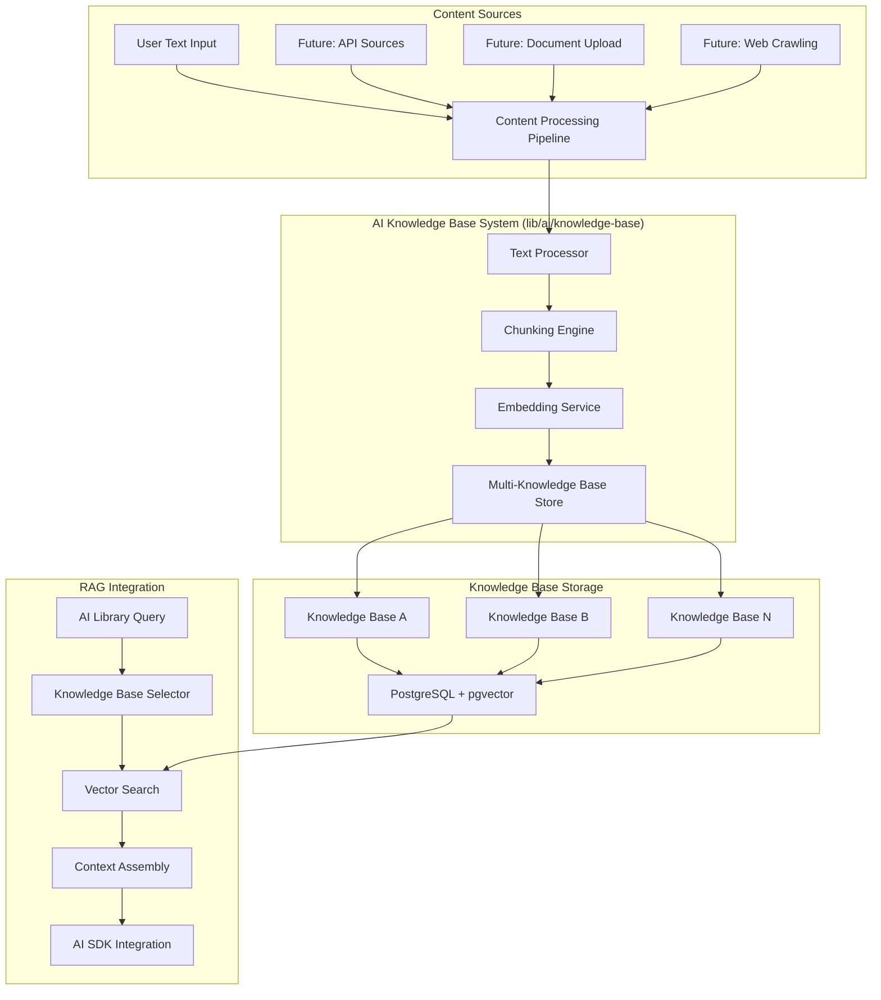

# AI Knowledge Base Implementation Documentation

## Overview

This document outlines the implementation of a comprehensive, multi-tenant knowledge base system designed for Retrieval-Augmented Generation (RAG) applications. The system supports multiple independent knowledge bases, allowing applications to configure which knowledge base to use for context retrieval. It uses PostgreSQL with the pgvector extension for vector storage and search, integrated with Drizzle ORM for type-safe database operations.

## Key Features

- **Multiple Knowledge Bases**: Support for multiple independent knowledge bases with isolated content
- **Flexible Content Sources**: Initial focus on user text input with planned support for API, documents, and web content
- **High-Performance Vector Search**: PostgreSQL with pgvector for efficient similarity search
- **Type-Safe Operations**: Full TypeScript integration with Drizzle ORM
- **RAG Integration**: Direct integration with the AI library for enhanced content generation

## Table of Contents

1. [Architecture Overview](#architecture-overview)
2. [Multi-Knowledge Base Design](#multi-knowledge-base-design)
3. [Database Schema Design](#database-schema-design)
4. [Implementation Phases](#implementation-phases)
5. [Content Processing Pipeline](#content-processing-pipeline)
6. [Vector Search Implementation](#vector-search-implementation)
7. [RAG Integration](#rag-integration)
8. [Performance Optimization](#performance-optimization)
9. [Best Practices](#best-practices)

---

## Architecture Overview

### High-Level Architecture



### Core Components

1. **Multi-Knowledge Base Manager**: Handles creation, selection, and management of multiple knowledge bases
2. **Content Processing Pipeline**: Handles text input processing and chunking (initial phase)
3. **Vector Storage**: PostgreSQL with pgvector extension for storing and searching embeddings
4. **Knowledge Base Selector**: Routes queries to the appropriate knowledge base
5. **Embedding Service**: Generates and manages vector embeddings for content
6. **RAG Integration**: Direct integration with the AI library for content generation

### Technology Stack

- **Database**: PostgreSQL 15+ with pgvector extension
- **ORM**: Drizzle ORM for type-safe database operations
- **Vector Search**: pgvector with HNSW indexing
- **Embeddings**: OpenAI text-embedding-3-small (1536 dimensions)
- **Content Processing**: Initial focus on text input with future extensibility
- **Integration**: Direct integration with AI SDK 5 Beta

---

## Multi-Knowledge Base Design

### Concept Overview

The system supports multiple independent knowledge bases, each containing its own isolated set of content. This allows applications to:

- **Separate Content by Context**: Different knowledge bases for different topics, clients, or use cases
- **Control Access**: Different permission levels for different knowledge bases
- **Optimize Performance**: Smaller, focused knowledge bases for faster search
- **Enable Specialization**: Domain-specific knowledge bases with tailored content

### Knowledge Base Selection

Applications can specify which knowledge base to use for content retrieval:

```typescript
// Example usage in AI library
const context = await knowledgeBaseService.search({
  query: "How to implement authentication?",
  knowledgeBaseId: "technical-docs-kb",
  limit: 5,
});

const response = await generateText({
  model: modelManager.getModel(),
  prompt: createRAGPrompt(userQuery, context),
});
```

### Implementation Location

All knowledge base functionality will be implemented in:

```
lib/ai/knowledge-base/
├── core/
│   ├── knowledge-base-manager.ts
│   ├── content-processor.ts
│   └── embedding-service.ts
├── search/
│   ├── vector-search.ts
│   └── knowledge-base-selector.ts
├── types/
│   └── knowledge-base.type.ts
└── index.ts
```

---

## Database Schema Design

### Core Knowledge Base Tables

```typescript
// lib/db/schema/knowledge-base/knowledge-base.table.ts
import {
  pgTable,
  uuid,
  varchar,
  text,
  timestamp,
  jsonb,
  boolean,
} from "drizzle-orm/pg-core";

/**
 * Knowledge bases for organizing and isolating content collections
 * Each knowledge base contains its own set of documents and chunks
 */
export const knowledgeBases = pgTable("knowledge_bases", {
  id: uuid("id").primaryKey().defaultRandom(),
  name: varchar("name", { length: 255 }).notNull(),
  description: text("description"),
  slug: varchar("slug", { length: 255 }).notNull().unique(),
  isActive: boolean("is_active").notNull().default(true),
  metadata: jsonb("metadata").$type<KnowledgeBaseMetadata>(),
  createdAt: timestamp("created_at").notNull().defaultNow(),
  updatedAt: timestamp("updated_at")
    .notNull()
    .defaultNow()
    .$onUpdate(() => new Date()),
});

// lib/db/schema/knowledge-base/knowledge-base-content.table.ts
import {
  pgTable,
  uuid,
  text,
  timestamp,
  jsonb,
  integer,
  boolean,
  foreignKey,
} from "drizzle-orm/pg-core";
import { contentSourceTypeEnum, contentStatusEnum } from "./enums";

/**
 * Content items within knowledge bases
 * Stores individual pieces of content with metadata
 */
export const knowledgeBaseContents = pgTable(
  "knowledge_base_contents",
  {
    id: uuid("id").primaryKey().defaultRandom(),
    knowledgeBaseId: uuid("knowledge_base_id").notNull(),
    title: varchar("title", { length: 255 }).notNull(),
    content: text("content").notNull(),
    sourceType: contentSourceTypeEnum("source_type").notNull().default("text"),
    status: contentStatusEnum("status").notNull().default("processing"),
    metadata: jsonb("metadata").$type<ContentMetadata>(),
    tokenCount: integer("token_count"),
    isActive: boolean("is_active").notNull().default(true),
    createdAt: timestamp("created_at").notNull().defaultNow(),
    updatedAt: timestamp("updated_at")
      .notNull()
      .defaultNow()
      .$onUpdate(() => new Date()),
    processedAt: timestamp("processed_at"),
  },
  (table) => ({
    knowledgeBaseFk: foreignKey({
      columns: [table.knowledgeBaseId],
      foreignColumns: [knowledgeBases.id],
      name: "knowledge_base_contents_knowledge_base_id_fk",
    }).onDelete("cascade"),
  })
);

// lib/db/schema/knowledge-base/knowledge-base-chunk.table.ts
import {
  pgTable,
  uuid,
  text,
  timestamp,
  jsonb,
  integer,
  vector,
  index,
  foreignKey,
} from "drizzle-orm/pg-core";

/**
 * Content chunks for vector search within knowledge bases
 * Each chunk represents a searchable segment of content with embeddings
 */
export const knowledgeBaseChunks = pgTable(
  "knowledge_base_chunks",
  {
    id: uuid("id").primaryKey().defaultRandom(),
    knowledgeBaseId: uuid("knowledge_base_id").notNull(),
    contentId: uuid("content_id").notNull(),
    content: text("content").notNull(),
    embedding: vector("embedding", { dimensions: 1536 }), // OpenAI text-embedding-3-small
    chunkIndex: integer("chunk_index").notNull(),
    startPosition: integer("start_position"),
    endPosition: integer("end_position"),
    metadata: jsonb("metadata").$type<ChunkMetadata>(),
    tokenCount: integer("token_count"),
    createdAt: timestamp("created_at").notNull().defaultNow(),
    updatedAt: timestamp("updated_at")
      .notNull()
      .defaultNow()
      .$onUpdate(() => new Date()),
  },
  (table) => ({
    embeddingIdx: index("knowledge_base_chunks_embedding_idx").using(
      "hnsw",
      table.embedding.op("vector_cosine_ops")
    ),
    knowledgeBaseIdIdx: index("knowledge_base_chunks_knowledge_base_id_idx").on(
      table.knowledgeBaseId
    ),
    contentIdIdx: index("knowledge_base_chunks_content_id_idx").on(
      table.contentId
    ),
    knowledgeBaseFk: foreignKey({
      columns: [table.knowledgeBaseId],
      foreignColumns: [knowledgeBases.id],
      name: "knowledge_base_chunks_knowledge_base_id_fk",
    }).onDelete("cascade"),
    contentFk: foreignKey({
      columns: [table.contentId],
      foreignColumns: [knowledgeBaseContents.id],
      name: "knowledge_base_chunks_content_id_fk",
    }).onDelete("cascade"),
  })
);
```

### Enum Definitions

```typescript
// lib/db/schema/knowledge-base/enums/content-source-type.enum.ts
import { pgEnum } from "drizzle-orm/pg-core";

/**
 * Content source types for knowledge base content
 * Currently focused on text input, with future expansion planned
 */
export const contentSourceTypeEnum = pgEnum("content_source_type", [
  "text", // User-provided text input (current focus)
  "api", // Future: API endpoints
  "upload", // Future: File uploads
  "url", // Future: Web content
]);

/**
 * Processing status for knowledge base content
 */
export const contentStatusEnum = pgEnum("content_status", [
  "pending",
  "processing",
  "indexed",
  "failed",
  "archived",
]);
```

### Type Definitions

```typescript
// lib/ai/knowledge-base/types/knowledge-base.type.ts
import { InferSelectModel, InferInsertModel } from "drizzle-orm";
import {
  knowledgeBases,
  knowledgeBaseContents,
  knowledgeBaseChunks,
} from "@/lib/db/schema/knowledge-base";

/**
 * Core knowledge base types
 */
export type KnowledgeBase = InferSelectModel<typeof knowledgeBases>;
export type NewKnowledgeBase = InferInsertModel<typeof knowledgeBases>;

export type KnowledgeBaseContent = InferSelectModel<
  typeof knowledgeBaseContents
>;
export type NewKnowledgeBaseContent = InferInsertModel<
  typeof knowledgeBaseContents
>;

export type KnowledgeBaseChunk = InferSelectModel<typeof knowledgeBaseChunks>;
export type NewKnowledgeBaseChunk = InferInsertModel<
  typeof knowledgeBaseChunks
>;

/**
 * Metadata interfaces
 */
export interface KnowledgeBaseMetadata {
  description?: string;
  tags?: string[];
  category?: string;
  isPrivate?: boolean;
  settings?: {
    maxContentSize?: number;
    chunkSize?: number;
    chunkOverlap?: number;
  };
}

export interface ContentMetadata {
  author?: string;
  language?: string;
  keywords?: string[];
  summary?: string;
  category?: string;
  tags?: string[];
  originalLength?: number;
  processingNotes?: string[];
}

export interface ChunkMetadata {
  sectionTitle?: string;
  chunkType: "paragraph" | "heading" | "list" | "other";
  confidence?: number;
  keywords?: string[];
  semanticScore?: number;
}

/**
 * Search and query interfaces
 */
export interface SearchOptions {
  knowledgeBaseId: string;
  query: string;
  limit?: number;
  threshold?: number;
  includeMetadata?: boolean;
  filters?: {
    contentType?: string;
    tags?: string[];
    dateRange?: {
      start: Date;
      end: Date;
    };
  };
}

export interface SearchResult {
  id: string;
  content: string;
  similarity: number;
  metadata?: ChunkMetadata;
  knowledgeBase: {
    id: string;
    name: string;
  };
  contentInfo: {
    id: string;
    title: string;
  };
}

/**
 * Processing interfaces
 */
export interface ProcessingOptions {
  chunkSize?: number;
  chunkOverlap?: number;
  preserveStructure?: boolean;
  extractKeywords?: boolean;
  generateSummary?: boolean;
}
```

---

## Implementation Phases

### Phase 1: Core Infrastructure (Weeks 1-2)

#### Objectives

- Set up PostgreSQL with pgvector extension
- Implement multi-knowledge base schema
- Create foundational Drizzle schema following project guidelines
- Establish embedding service integration with AI SDK

#### Deliverables

**1.1 Database Setup**

```bash
# Install pgvector extension
CREATE EXTENSION IF NOT EXISTS vector;

# Create initial tables
npm run db:generate
npm run db:migrate
```

**1.2 Core Schema Implementation**

```typescript
// lib/db/schema/knowledge-base/index.ts
export * from "./knowledge-base.table";
export * from "./knowledge-base-content.table";
export * from "./knowledge-base-chunk.table";
export * from "./enums";

// Add to lib/db/schema/index.ts
export * from "./knowledge-base";
```

**1.3 Knowledge Base Directory Structure**

```typescript
// lib/ai/knowledge-base/index.ts
export * from "./core/knowledge-base-manager";
export * from "./core/content-processor";
export * from "./core/embedding-service";
export * from "./search/vector-search";
export * from "./search/knowledge-base-selector";
export * from "./types/knowledge-base.type";
```

**1.4 Embedding Service Integration**

```typescript
// lib/ai/knowledge-base/core/embedding-service.ts
import { embed } from "ai";
import { ModelManager } from "@/lib/ai/core/model-manager";

/**
 * Embedding service integrated with AI SDK 5 Beta
 * Handles text embedding generation for vector search
 */
export class EmbeddingService {
  private modelManager: ModelManager;

  constructor() {
    this.modelManager = new ModelManager();
  }

  async generateEmbedding(text: string): Promise<number[]> {
    try {
      const { embedding } = await embed({
        model: this.modelManager.getModel("text-embedding-3-small"),
        value: text.trim(),
      });

      return embedding;
    } catch (error) {
      console.error("Failed to generate embedding:", error);
      throw new Error("Embedding generation failed");
    }
  }

  async generateEmbeddings(texts: string[]): Promise<number[][]> {
    // Process in batches to avoid rate limits
    const batchSize = 10;
    const results: number[][] = [];

    for (let i = 0; i < texts.length; i += batchSize) {
      const batch = texts.slice(i, i + batchSize);
      const batchPromises = batch.map((text) => this.generateEmbedding(text));
      const batchResults = await Promise.all(batchPromises);
      results.push(...batchResults);

      // Small delay between batches
      if (i + batchSize < texts.length) {
        await new Promise((resolve) => setTimeout(resolve, 100));
      }
    }

    return results;
  }

  /**
   * Calculate similarity between two embeddings using cosine similarity
   */
  calculateSimilarity(embedding1: number[], embedding2: number[]): number {
    if (embedding1.length !== embedding2.length) {
      throw new Error("Embeddings must have the same dimensions");
    }

    let dotProduct = 0;
    let magnitude1 = 0;
    let magnitude2 = 0;

    for (let i = 0; i < embedding1.length; i++) {
      dotProduct += embedding1[i] * embedding2[i];
      magnitude1 += embedding1[i] * embedding1[i];
      magnitude2 += embedding2[i] * embedding2[i];
    }

    magnitude1 = Math.sqrt(magnitude1);
    magnitude2 = Math.sqrt(magnitude2);

    if (magnitude1 === 0 || magnitude2 === 0) {
      return 0;
    }

    return dotProduct / (magnitude1 * magnitude2);
  }
}
```

### Phase 2: Text Content Processing Pipeline (Weeks 3-4)

#### Objectives

- Implement text content processing and validation
- Create intelligent chunking strategies for text content
- Build content management system
- Add metadata extraction and keyword generation

#### Deliverables

**2.1 Content Processor**

```typescript
// lib/ai/knowledge-base/core/content-processor.ts
import { EmbeddingService } from "./embedding-service";
import { ChunkingService } from "./chunking-service";
import type {
  ProcessingOptions,
  ContentMetadata,
  NewKnowledgeBaseContent,
  NewKnowledgeBaseChunk,
} from "../types/knowledge-base.type";

/**
 * Processes text content for knowledge base storage
 * Handles text validation, chunking, and metadata extraction
 */
export class ContentProcessor {
  private embeddingService: EmbeddingService;
  private chunkingService: ChunkingService;

  constructor() {
    this.embeddingService = new EmbeddingService();
    this.chunkingService = new ChunkingService();
  }

  async processTextContent(
    knowledgeBaseId: string,
    title: string,
    content: string,
    options: ProcessingOptions = {}
  ): Promise<{
    content: NewKnowledgeBaseContent;
    chunks: NewKnowledgeBaseChunk[];
  }> {
    // Validate and clean text content
    const cleanedContent = this.validateAndCleanText(content);

    // Extract metadata
    const metadata = await this.extractMetadata(cleanedContent, options);

    // Create content record
    const contentRecord: NewKnowledgeBaseContent = {
      knowledgeBaseId,
      title: title.trim(),
      content: cleanedContent,
      sourceType: "text",
      status: "processing",
      metadata,
      tokenCount: this.estimateTokenCount(cleanedContent),
      isActive: true,
    };

    // Create chunks
    const textChunks = await this.chunkingService.chunkText(
      cleanedContent,
      options
    );

    // Generate embeddings for chunks
    const embeddings = await this.embeddingService.generateEmbeddings(
      textChunks.map((chunk) => chunk.content)
    );

    // Create chunk records
    const chunkRecords: NewKnowledgeBaseChunk[] = textChunks.map(
      (chunk, index) => ({
        knowledgeBaseId,
        contentId: "", // Will be set after content is created
        content: chunk.content,
        embedding: embeddings[index],
        chunkIndex: index,
        startPosition: chunk.startPosition,
        endPosition: chunk.endPosition,
        metadata: chunk.metadata,
        tokenCount: this.estimateTokenCount(chunk.content),
      })
    );

    return {
      content: contentRecord,
      chunks: chunkRecords,
    };
  }

  private validateAndCleanText(content: string): string {
    if (!content || content.trim().length === 0) {
      throw new Error("Content cannot be empty");
    }

    if (content.length > 1000000) {
      // 1MB limit
      throw new Error("Content is too large (max 1MB)");
    }

    // Clean and normalize text
    return content
      .replace(/\r\n/g, "\n") // Normalize line endings
      .replace(/\n{3,}/g, "\n\n") // Reduce excessive line breaks
      .trim();
  }

  private async extractMetadata(
    content: string,
    options: ProcessingOptions
  ): Promise<ContentMetadata> {
    const metadata: ContentMetadata = {
      originalLength: content.length,
      processingNotes: [],
    };

    if (options.extractKeywords) {
      metadata.keywords = await this.extractKeywords(content);
    }

    if (options.generateSummary) {
      metadata.summary = await this.generateSummary(content);
    }

    return metadata;
  }

  private async extractKeywords(content: string): Promise<string[]> {
    // Simple keyword extraction - can be enhanced with NLP libraries
    const words = content.toLowerCase().match(/\b[a-zA-Z]{3,}\b/g) || [];

    const wordCount = new Map<string, number>();
    words.forEach((word) => {
      wordCount.set(word, (wordCount.get(word) || 0) + 1);
    });

    return Array.from(wordCount.entries())
      .sort((a, b) => b[1] - a[1])
      .slice(0, 10)
      .map(([word]) => word);
  }

  private async generateSummary(content: string): Promise<string> {
    // Simple summarization - first paragraph or first 200 characters
    const firstParagraph = content.split("\n\n")[0];
    return firstParagraph.length > 200
      ? firstParagraph.substring(0, 200) + "..."
      : firstParagraph;
  }

  private estimateTokenCount(text: string): number {
    // Rough estimation: ~4 characters per token
    return Math.ceil(text.length / 4);
  }
}
```

**2.2 Text Chunking Service**

```typescript
// lib/ai/knowledge-base/core/chunking-service.ts
import type {
  ChunkMetadata,
  ProcessingOptions,
} from "../types/knowledge-base.type";

interface TextChunk {
  content: string;
  startPosition: number;
  endPosition: number;
  metadata: ChunkMetadata;
}

/**
 * Handles intelligent text chunking for knowledge base content
 * Optimized for text content with semantic boundary preservation
 */
export class ChunkingService {
  private readonly DEFAULT_CHUNK_SIZE = 512; // tokens
  private readonly DEFAULT_OVERLAP = 50; // tokens
  private readonly MIN_CHUNK_SIZE = 50; // tokens

  async chunkText(
    content: string,
    options: ProcessingOptions = {}
  ): Promise<TextChunk[]> {
    const chunkSize = options.chunkSize || this.DEFAULT_CHUNK_SIZE;
    const overlap = options.chunkOverlap || this.DEFAULT_OVERLAP;

    if (options.preserveStructure) {
      return this.structureAwareChunking(content, chunkSize, overlap);
    } else {
      return this.recursiveChunking(content, chunkSize, overlap);
    }
  }

  private async recursiveChunking(
    content: string,
    chunkSize: number,
    overlap: number
  ): Promise<TextChunk[]> {
    // Define separators in order of preference
    const separators = ["\n\n", "\n", ". ", " ", ""];

    return this.splitTextRecursively(content, separators, chunkSize, overlap);
  }

  private async structureAwareChunking(
    content: string,
    chunkSize: number,
    overlap: number
  ): Promise<TextChunk[]> {
    const chunks: TextChunk[] = [];
    const sections = this.identifyStructuralElements(content);

    for (const section of sections) {
      if (this.estimateTokenCount(section.content) <= chunkSize) {
        // Section fits in one chunk
        chunks.push({
          content: section.content,
          startPosition: section.start,
          endPosition: section.end,
          metadata: {
            chunkType: section.type,
            sectionTitle: section.title,
          },
        });
      } else {
        // Section needs to be split
        const subChunks = await this.recursiveChunking(
          section.content,
          chunkSize,
          overlap
        );

        subChunks.forEach((chunk, index) => {
          chunks.push({
            ...chunk,
            startPosition: section.start + chunk.startPosition,
            endPosition: section.start + chunk.endPosition,
            metadata: {
              ...chunk.metadata,
              sectionTitle: section.title,
            },
          });
        });
      }
    }

    return chunks;
  }

  private splitTextRecursively(
    text: string,
    separators: string[],
    chunkSize: number,
    overlap: number,
    startPosition = 0
  ): TextChunk[] {
    const chunks: TextChunk[] = [];

    if (this.estimateTokenCount(text) <= chunkSize) {
      // Text fits in one chunk
      return [
        {
          content: text.trim(),
          startPosition,
          endPosition: startPosition + text.length,
          metadata: {
            chunkType: "paragraph",
          },
        },
      ];
    }

    const separator = separators[0];
    const remainingSeparators = separators.slice(1);

    if (separator === "") {
      // Last resort: split by character count
      return this.splitByCharacterCount(
        text,
        chunkSize,
        overlap,
        startPosition
      );
    }

    const parts = text.split(separator);
    let currentChunk = "";
    let currentStart = startPosition;

    for (let i = 0; i < parts.length; i++) {
      const part = parts[i] + (i < parts.length - 1 ? separator : "");
      const potentialChunk = currentChunk + part;

      if (
        this.estimateTokenCount(potentialChunk) <= chunkSize ||
        currentChunk === ""
      ) {
        currentChunk = potentialChunk;
      } else {
        // Current chunk is full, process it
        if (currentChunk.trim()) {
          const subChunks = this.splitTextRecursively(
            currentChunk.trim(),
            remainingSeparators,
            chunkSize,
            overlap,
            currentStart
          );
          chunks.push(...subChunks);
        }

        currentStart = startPosition + text.indexOf(part, currentStart);
        currentChunk = part;
      }
    }

    // Process remaining chunk
    if (currentChunk.trim()) {
      const subChunks = this.splitTextRecursively(
        currentChunk.trim(),
        remainingSeparators,
        chunkSize,
        overlap,
        currentStart
      );
      chunks.push(...subChunks);
    }

    return this.addOverlap(chunks, overlap);
  }

  private splitByCharacterCount(
    text: string,
    chunkSize: number,
    overlap: number,
    startPosition: number
  ): TextChunk[] {
    const chunks: TextChunk[] = [];
    const avgCharsPerToken = 4;
    const maxChunkLength = chunkSize * avgCharsPerToken;
    const overlapLength = overlap * avgCharsPerToken;

    let position = 0;

    while (position < text.length) {
      const endPosition = Math.min(position + maxChunkLength, text.length);
      const chunkContent = text.slice(position, endPosition).trim();

      if (chunkContent) {
        chunks.push({
          content: chunkContent,
          startPosition: startPosition + position,
          endPosition: startPosition + endPosition,
          metadata: {
            chunkType: "other",
          },
        });
      }

      position = endPosition - overlapLength;
      if (position <= 0) position = endPosition;
    }

    return chunks;
  }

  private identifyStructuralElements(content: string): Array<{
    content: string;
    start: number;
    end: number;
    type: "heading" | "paragraph" | "list";
    title?: string;
  }> {
    const elements = [];
    const lines = content.split("\n");
    let currentPosition = 0;

    for (const line of lines) {
      const lineStart = currentPosition;
      const lineEnd = currentPosition + line.length + 1; // +1 for newline

      if (line.trim().match(/^#+\s/)) {
        // Heading
        elements.push({
          content: line,
          start: lineStart,
          end: lineEnd,
          type: "heading" as const,
          title: line.replace(/^#+\s/, "").trim(),
        });
      } else if (line.trim().match(/^[-*+]\s/)) {
        // List item
        elements.push({
          content: line,
          start: lineStart,
          end: lineEnd,
          type: "list" as const,
        });
      } else if (line.trim()) {
        // Paragraph
        elements.push({
          content: line,
          start: lineStart,
          end: lineEnd,
          type: "paragraph" as const,
        });
      }

      currentPosition = lineEnd;
    }

    return elements;
  }

  private addOverlap(chunks: TextChunk[], overlapTokens: number): TextChunk[] {
    if (chunks.length <= 1 || overlapTokens <= 0) {
      return chunks;
    }

    const avgCharsPerToken = 4;
    const overlapChars = overlapTokens * avgCharsPerToken;

    for (let i = 1; i < chunks.length; i++) {
      const prevChunk = chunks[i - 1];
      const currentChunk = chunks[i];

      // Add overlap from previous chunk to current chunk
      const overlapContent = prevChunk.content.slice(-overlapChars);
      if (overlapContent.trim()) {
        chunks[i] = {
          ...currentChunk,
          content: overlapContent + " " + currentChunk.content,
          startPosition: Math.max(0, currentChunk.startPosition - overlapChars),
        };
      }
    }

    return chunks;
  }

  private estimateTokenCount(text: string): number {
    // Rough estimation: ~4 characters per token
    return Math.ceil(text.length / 4);
  }
}
```

````

### Phase 3: Vector Search Engine (Weeks 5-6)

#### Objectives

- Implement high-performance vector search
- Add metadata filtering capabilities
- Create hybrid search (vector + keyword)
- Build search result ranking and reranking

#### Deliverables

**3.1 Vector Search Service**

```typescript
// lib/services/vector-search.service.ts
export class VectorSearchService {
  async searchSimilar(
    query: string,
    options: SearchOptions = {}
  ): Promise<SearchResult[]> {
    const queryEmbedding = await this.embeddingService.generateEmbedding(query);

    const similarChunks = await this.db
      .select({
        id: documentChunks.id,
        content: documentChunks.content,
        metadata: documentChunks.metadata,
        document: {
          id: documents.id,
          title: documents.title,
          url: documents.url,
        },
        similarity: sql<number>`1 - (${documentChunks.embedding} <=> ${queryEmbedding})`,
      })
      .from(documentChunks)
      .leftJoin(documents, eq(documentChunks.documentId, documents.id))
      .where(
        and(
          gt(
            sql`1 - (${documentChunks.embedding} <=> ${queryEmbedding})`,
            options.threshold || 0.7
          ),
          options.filters ? this.buildFilters(options.filters) : undefined
        )
      )
      .orderBy(
        desc(sql`1 - (${documentChunks.embedding} <=> ${queryEmbedding})`)
      )
      .limit(options.limit || 10);

    return similarChunks;
  }

  async hybridSearch(
    query: string,
    options: HybridSearchOptions = {}
  ): Promise<SearchResult[]> {
    // Combine vector search with keyword search
    const vectorResults = await this.searchSimilar(query, {
      ...options,
      limit: options.limit ? options.limit * 2 : 20,
    });

    const keywordResults = await this.keywordSearch(query, options);

    // Merge and rerank results
    return this.mergeAndRerank(vectorResults, keywordResults, options);
  }
}
````

**3.2 Advanced Indexing**

```sql
-- Create optimized indexes for vector search
CREATE INDEX CONCURRENTLY document_chunks_embedding_hnsw_idx
ON document_chunks
USING hnsw (embedding vector_cosine_ops)
WITH (m = 16, ef_construction = 64);

-- Create indexes for metadata filtering
CREATE INDEX CONCURRENTLY document_chunks_metadata_gin_idx
ON document_chunks
USING gin (metadata);

-- Create composite indexes for common query patterns
CREATE INDEX CONCURRENTLY documents_status_source_idx
ON documents (status, source_type, created_at);
```

### Phase 4: Knowledge Base Manager & RAG Integration (Weeks 7-8)

#### Objectives

- Implement multi-knowledge base management
- Create RAG integration with AI library
- Build knowledge base selection and routing
- Add comprehensive API for knowledge base operations

#### Deliverables

**4.1 Knowledge Base Manager**

```typescript
// lib/ai/knowledge-base/core/knowledge-base-manager.ts
import { db } from "@/lib/db";
import {
  knowledgeBases,
  knowledgeBaseContents,
  knowledgeBaseChunks,
} from "@/lib/db/schema/knowledge-base";
import { eq, and, desc } from "drizzle-orm";
import { ContentProcessor } from "./content-processor";
import type {
  KnowledgeBase,
  NewKnowledgeBase,
  SearchOptions,
  SearchResult,
  ProcessingOptions,
} from "../types/knowledge-base.type";

/**
 * Main manager for knowledge base operations
 * Handles creation, content management, and search coordination
 */
export class KnowledgeBaseManager {
  private contentProcessor: ContentProcessor;

  constructor() {
    this.contentProcessor = new ContentProcessor();
  }

  async createKnowledgeBase(data: NewKnowledgeBase): Promise<KnowledgeBase> {
    const [knowledgeBase] = await db
      .insert(knowledgeBases)
      .values(data)
      .returning();

    return knowledgeBase;
  }

  async getKnowledgeBase(id: string): Promise<KnowledgeBase | null> {
    const [knowledgeBase] = await db
      .select()
      .from(knowledgeBases)
      .where(and(eq(knowledgeBases.id, id), eq(knowledgeBases.isActive, true)));

    return knowledgeBase || null;
  }

  async listKnowledgeBases(): Promise<KnowledgeBase[]> {
    return db
      .select()
      .from(knowledgeBases)
      .where(eq(knowledgeBases.isActive, true))
      .orderBy(desc(knowledgeBases.createdAt));
  }

  async addTextContent(
    knowledgeBaseId: string,
    title: string,
    content: string,
    options: ProcessingOptions = {}
  ): Promise<{ contentId: string; chunkCount: number }> {
    // Verify knowledge base exists
    const kb = await this.getKnowledgeBase(knowledgeBaseId);
    if (!kb) {
      throw new Error("Knowledge base not found");
    }

    // Process the content
    const { content: contentRecord, chunks: chunkRecords } =
      await this.contentProcessor.processTextContent(
        knowledgeBaseId,
        title,
        content,
        options
      );

    // Insert content
    const [insertedContent] = await db
      .insert(knowledgeBaseContents)
      .values(contentRecord)
      .returning();

    // Update chunk records with content ID
    const chunksWithContentId = chunkRecords.map((chunk) => ({
      ...chunk,
      contentId: insertedContent.id,
    }));

    // Insert chunks
    await db.insert(knowledgeBaseChunks).values(chunksWithContentId);

    // Update content status
    await db
      .update(knowledgeBaseContents)
      .set({ status: "indexed", processedAt: new Date() })
      .where(eq(knowledgeBaseContents.id, insertedContent.id));

    return {
      contentId: insertedContent.id,
      chunkCount: chunksWithContentId.length,
    };
  }

  async deleteContent(contentId: string): Promise<void> {
    await db
      .update(knowledgeBaseContents)
      .set({ isActive: false })
      .where(eq(knowledgeBaseContents.id, contentId));
  }

  async getContentList(knowledgeBaseId: string) {
    return db
      .select({
        id: knowledgeBaseContents.id,
        title: knowledgeBaseContents.title,
        status: knowledgeBaseContents.status,
        tokenCount: knowledgeBaseContents.tokenCount,
        createdAt: knowledgeBaseContents.createdAt,
      })
      .from(knowledgeBaseContents)
      .where(
        and(
          eq(knowledgeBaseContents.knowledgeBaseId, knowledgeBaseId),
          eq(knowledgeBaseContents.isActive, true)
        )
      )
      .orderBy(desc(knowledgeBaseContents.createdAt));
  }

  async getKnowledgeBaseStats(knowledgeBaseId: string) {
    const [stats] = await db
      .select({
        contentCount: sql<number>`count(distinct ${knowledgeBaseContents.id})`,
        chunkCount: sql<number>`count(${knowledgeBaseChunks.id})`,
        totalTokens: sql<number>`sum(${knowledgeBaseContents.tokenCount})`,
      })
      .from(knowledgeBaseContents)
      .leftJoin(
        knowledgeBaseChunks,
        eq(knowledgeBaseContents.id, knowledgeBaseChunks.contentId)
      )
      .where(
        and(
          eq(knowledgeBaseContents.knowledgeBaseId, knowledgeBaseId),
          eq(knowledgeBaseContents.isActive, true)
        )
      );

    return stats || { contentCount: 0, chunkCount: 0, totalTokens: 0 };
  }
}
```

---

## RAG Integration

### Integration with AI Library

The knowledge base system integrates seamlessly with the existing AI library to provide context-aware content generation. Here's how it works:

```typescript
// lib/ai/knowledge-base/search/knowledge-base-selector.ts
import { VectorSearchService } from "./vector-search";
import type { SearchOptions, SearchResult } from "../types/knowledge-base.type";

/**
 * Handles knowledge base selection and context retrieval for RAG
 */
export class KnowledgeBaseSelector {
  private vectorSearch: VectorSearchService;

  constructor() {
    this.vectorSearch = new VectorSearchService();
  }

  async retrieveContext(options: SearchOptions): Promise<SearchResult[]> {
    const results = await this.vectorSearch.searchSimilar(options);

    // Filter and rank results for RAG context
    return results
      .filter((result) => result.similarity >= (options.threshold || 0.7))
      .slice(0, options.limit || 5);
  }

  async retrieveContextForPrompt(
    query: string,
    knowledgeBaseId: string,
    maxTokens: number = 2000
  ): Promise<{ context: string; sources: string[] }> {
    const results = await this.retrieveContext({
      query,
      knowledgeBaseId,
      limit: 10,
      threshold: 0.7,
    });

    let context = "";
    let currentTokens = 0;
    const sources: string[] = [];

    for (const result of results) {
      const resultTokens = Math.ceil(result.content.length / 4);

      if (currentTokens + resultTokens > maxTokens) {
        break;
      }

      context += `${result.content}\n\n`;
      currentTokens += resultTokens;

      if (!sources.includes(result.contentInfo.title)) {
        sources.push(result.contentInfo.title);
      }
    }

    return { context: context.trim(), sources };
  }
}
```

### Usage in AI Library

```typescript
// Example integration in lib/ai/content/creator.ts
import { KnowledgeBaseSelector } from "../knowledge-base";

export class ContentCreator {
  private knowledgeBaseSelector: KnowledgeBaseSelector;

  constructor() {
    this.modelManager = new ModelManager();
    this.knowledgeBaseSelector = new KnowledgeBaseSelector();
  }

  async generateContentWithContext(
    topic: string,
    knowledgeBaseId?: string,
    options: GenerationOptions = {}
  ) {
    let context = "";
    let sources: string[] = [];

    if (knowledgeBaseId) {
      const contextData =
        await this.knowledgeBaseSelector.retrieveContextForPrompt(
          topic,
          knowledgeBaseId,
          options.maxContextTokens || 2000
        );
      context = contextData.context;
      sources = contextData.sources;
    }

    const prompt = this.buildRAGPrompt(topic, context, options);

    const result = await generateText({
      model: this.modelManager.getModel(),
      prompt,
      temperature: options.temperature || 0.7,
    });

    return {
      content: result.text,
      sources,
      hasContext: context.length > 0,
    };
  }

  private buildRAGPrompt(
    topic: string,
    context: string,
    options: GenerationOptions
  ): string {
    if (!context) {
      return `Write about ${topic} in a ${
        options.tone || "professional"
      } tone.`;
    }

    return `Based on the following context information, write about ${topic} in a ${
      options.tone || "professional"
    } tone.

Context:
${context}

Topic: ${topic}

Please use the context information to provide accurate and relevant content. If the context doesn't contain relevant information for the topic, you may supplement with your general knowledge but clearly indicate what comes from the provided context.`;
  }
}
```

### API Integration

```typescript
// app/api/ai/content/generate-with-context/route.ts
import { NextRequest } from "next/server";
import { ContentCreator } from "@/lib/ai/content/creator";
import { auth } from "@/lib/auth";

export async function POST(request: NextRequest) {
  const session = await auth();
  if (!session) {
    return Response.json({ error: "Unauthorized" }, { status: 401 });
  }

  const { topic, knowledgeBaseId, options } = await request.json();

  const contentCreator = new ContentCreator();

  try {
    const result = await contentCreator.generateContentWithContext(
      topic,
      knowledgeBaseId,
      options
    );

    return Response.json({
      content: result.content,
      sources: result.sources,
      hasContext: result.hasContext,
    });
  } catch (error) {
    console.error("Content generation error:", error);
    return Response.json({ error: "Generation failed" }, { status: 500 });
  }
}
```

### Phase 5: Future Content Sources Extension (Future Development)

**Note**: This phase is planned for future development and focuses on extending beyond text input.

#### Planned Future Sources

**API Integration**

```typescript
// Future: lib/ai/knowledge-base/sources/api-source.ts
export class APISource {
  async syncFromAPI(knowledgeBaseId: string, config: APISourceConfig) {
    // Implementation for API data extraction
  }
}
```

**Document Upload**

```typescript
// Future: lib/ai/knowledge-base/sources/document-source.ts
export class DocumentSource {
  async processUploadedDocument(knowledgeBaseId: string, file: File) {
    // Implementation for document processing
  }
}
```

**Web Crawling**

```typescript
// Future: lib/ai/knowledge-base/sources/web-crawler.ts
export class WebCrawler {
  async crawlWebsite(knowledgeBaseId: string, config: CrawlConfig) {
    // Implementation for web content extraction
  }
}
```

---

## Advanced Features (Future Development)

#### Objectives

- Implement semantic search enhancements
- Add content versioning and change tracking
- Create analytics and performance monitoring
- Build admin interface for knowledge base management

#### Deliverables

**5.1 Semantic Enhancement**

```typescript
// lib/services/semantic-enhancement.service.ts
export class SemanticEnhancementService {
  async enhanceQuery(query: string): Promise<EnhancedQuery> {
    // Query expansion using synonyms and related terms
    const expandedTerms = await this.expandQuery(query);

    // Intent classification
    const intent = await this.classifyIntent(query);

    // Generate alternative phrasings
    const alternatives = await this.generateAlternatives(query);

    return {
      originalQuery: query,
      expandedTerms,
      intent,
      alternatives,
    };
  }

  async rerank(
    query: string,
    results: SearchResult[]
  ): Promise<SearchResult[]> {
    // Use cross-encoder or more sophisticated ranking
    const scores = await this.calculateRelevanceScores(query, results);

    return results
      .map((result, index) => ({ ...result, score: scores[index] }))
      .sort((a, b) => b.score - a.score);
  }
}
```

**5.2 Analytics and Monitoring**

```typescript
// lib/db/schema/knowledge-base/analytics.table.ts
export const searchAnalytics = pgTable("search_analytics", {
  id: uuid("id").defaultRandom().primaryKey(),
  query: text("query").notNull(),
  resultsCount: integer("results_count").notNull(),
  clickedResultId: uuid("clicked_result_id"),
  responseTime: integer("response_time"), // in milliseconds
  userId: uuid("user_id"),
  sessionId: text("session_id"),
  createdAt: timestamp("created_at").notNull().defaultNow(),
});
```

---

## Content Processing Pipeline

### Current Support: Text Content

The initial implementation focuses exclusively on text content processing to establish a solid foundation:

1. **User Text Input**: Direct text input from users via forms or API
2. **Text Validation**: Content length limits, encoding validation
3. **Text Cleaning**: Normalization, formatting standardization
4. **Metadata Extraction**: Automated keyword extraction, basic summarization

### Future Content Types (Planned)

1. **Document Upload**: `.pdf`, `.docx`, `.txt`, `.md`
2. **Web Content**: HTML pages, articles, documentation
3. **API Data**: JSON, XML responses from external APIs
4. **Structured Data**: CSV, database exports

### Text Chunking Strategies

#### 1. Recursive Character Chunking (Recommended Default)

```typescript
interface RecursiveChunkingOptions {
  chunkSize: number; // Target chunk size in tokens
  overlap: number; // Overlap between chunks
  separators: string[]; // Preference order for splitting
}

// Default separators: ['\n\n', '\n', ' ', '']
// Preserves semantic boundaries while respecting size limits
```

#### 2. Document-Aware Chunking

```typescript
interface DocumentAwareChunkingOptions {
  respectHeadings: boolean; // Keep headings with their content
  preserveStructure: boolean; // Maintain document hierarchy
  chunkBySection: boolean; // Split by document sections
}
```

#### 3. Semantic Chunking

```typescript
interface SemanticChunkingOptions {
  similarityThreshold: number; // Threshold for topic coherence
  minChunkSize: number; // Minimum chunk size
  maxChunkSize: number; // Maximum chunk size
}
```

### Content Management

The knowledge base system provides comprehensive content lifecycle management:

- **Content Validation**: Ensures text quality and appropriate length limits
- **Metadata Generation**: Automatic extraction of keywords and summaries
- **Version Control**: Track content updates and modifications (future enhancement)
- **Soft Deletion**: Content is marked inactive rather than permanently deleted
- **Status Tracking**: Monitor processing status from pending to indexed

---

## Vector Search Implementation

### Index Configuration

#### HNSW Index (Recommended for Production)

```sql
-- Create HNSW index for high-recall, low-latency search
CREATE INDEX document_chunks_embedding_hnsw_idx
ON document_chunks
USING hnsw (embedding vector_cosine_ops)
WITH (
  m = 16,              -- Number of bi-directional links for each node
  ef_construction = 64 -- Size of dynamic candidate list during construction
);

-- Adjust search parameters for runtime
SET hnsw.ef_search = 100; -- Higher values = better recall, slower search
```

#### IVFFlat Index (Alternative for Large Datasets)

```sql
-- Create IVFFlat index for memory-efficient search
CREATE INDEX document_chunks_embedding_ivfflat_idx
ON document_chunks
USING ivfflat (embedding vector_cosine_ops)
WITH (lists = 100); -- Number of clusters

-- Adjust search parameters
SET ivfflat.probes = 10; -- Number of clusters to search
```

### Search Query Examples

#### Basic Similarity Search

```typescript
async function searchSimilar(query: string, limit: number = 10) {
  const queryEmbedding = await embeddingService.generateEmbedding(query);

  return db
    .select({
      id: documentChunks.id,
      content: documentChunks.content,
      documentTitle: documents.title,
      similarity: sql<number>`1 - (${documentChunks.embedding} <=> ${queryEmbedding})`,
    })
    .from(documentChunks)
    .leftJoin(documents, eq(documentChunks.documentId, documents.id))
    .orderBy(desc(sql`1 - (${documentChunks.embedding} <=> ${queryEmbedding})`))
    .limit(limit);
}
```

#### Filtered Search with Metadata

```typescript
async function searchWithFilters(
  query: string,
  filters: SearchFilters,
  limit: number = 10
) {
  const queryEmbedding = await embeddingService.generateEmbedding(query);

  return db
    .select({
      id: documentChunks.id,
      content: documentChunks.content,
      documentTitle: documents.title,
      similarity: sql<number>`1 - (${documentChunks.embedding} <=> ${queryEmbedding})`,
    })
    .from(documentChunks)
    .leftJoin(documents, eq(documentChunks.documentId, documents.id))
    .where(
      and(
        gt(sql`1 - (${documentChunks.embedding} <=> ${queryEmbedding})`, 0.7),
        filters.documentType
          ? eq(documents.sourceType, filters.documentType)
          : undefined,
        filters.dateRange
          ? and(
              gte(documents.createdAt, filters.dateRange.start),
              lte(documents.createdAt, filters.dateRange.end)
            )
          : undefined,
        filters.tags
          ? sql`${documents.metadata}->>'tags' ?| ${filters.tags}`
          : undefined
      )
    )
    .orderBy(desc(sql`1 - (${documentChunks.embedding} <=> ${queryEmbedding})`))
    .limit(limit);
}
```

#### Hybrid Search (Vector + Keyword)

```typescript
async function hybridSearch(query: string, options: HybridSearchOptions) {
  // Vector search
  const vectorResults = await searchSimilar(query, options.vectorLimit);

  // Keyword search using PostgreSQL full-text search
  const keywordResults = await db
    .select({
      id: documentChunks.id,
      content: documentChunks.content,
      documentTitle: documents.title,
      rank: sql<number>`ts_rank(to_tsvector('english', ${documentChunks.content}), plainto_tsquery('english', ${query}))`,
    })
    .from(documentChunks)
    .leftJoin(documents, eq(documentChunks.documentId, documents.id))
    .where(
      sql`to_tsvector('english', ${documentChunks.content}) @@ plainto_tsquery('english', ${query})`
    )
    .orderBy(
      desc(
        sql`ts_rank(to_tsvector('english', ${documentChunks.content}), plainto_tsquery('english', ${query}))`
      )
    )
    .limit(options.keywordLimit);

  // Merge and rerank results
  return mergeSearchResults(vectorResults, keywordResults, options.weights);
}
```

---

## Performance Optimization

### Database Optimization

#### Connection Pooling

```typescript
// lib/db/config.ts
export const dbConfig = {
  host: process.env.DATABASE_HOST,
  port: parseInt(process.env.DATABASE_PORT || "5432"),
  database: process.env.DATABASE_NAME,
  username: process.env.DATABASE_USER,
  password: process.env.DATABASE_PASSWORD,
  ssl: process.env.NODE_ENV === "production",

  // Connection pooling
  max: 20, // Maximum number of connections
  idleTimeoutMillis: 30000, // Close idle connections after 30s
  connectionTimeoutMillis: 2000, // Connection timeout
};
```

#### Memory Configuration

```sql
-- PostgreSQL configuration for vector workloads
-- Add to postgresql.conf

# Memory settings
shared_buffers = 256MB                  # 25% of RAM for small instances
effective_cache_size = 1GB              # 75% of RAM
work_mem = 64MB                         # For sorting and hashing operations
maintenance_work_mem = 256MB            # For VACUUM and index creation

# Vector-specific settings
hnsw.ef_search = 100                    # Default search effort
ivfflat.probes = 10                     # Default probe count

# Parallel processing
max_parallel_workers = 4
max_parallel_workers_per_gather = 2
max_parallel_maintenance_workers = 2
```

#### Index Maintenance

```sql
-- Monitor index usage
SELECT
  schemaname,
  tablename,
  indexname,
  idx_scan,
  idx_tup_read,
  idx_tup_fetch
FROM pg_stat_user_indexes
WHERE tablename LIKE '%document_chunk%';

-- Rebuild indexes when necessary
REINDEX INDEX CONCURRENTLY document_chunks_embedding_hnsw_idx;

-- Update statistics
ANALYZE document_chunks;
```

### Application-Level Optimization

#### Embedding Caching

```typescript
// lib/services/embedding-cache.service.ts
export class EmbeddingCacheService {
  private cache = new Map<string, number[]>();

  async getEmbedding(text: string): Promise<number[]> {
    const hash = this.generateTextHash(text);

    if (this.cache.has(hash)) {
      return this.cache.get(hash)!;
    }

    const embedding = await this.embeddingService.generateEmbedding(text);
    this.cache.set(hash, embedding);

    return embedding;
  }

  private generateTextHash(text: string): string {
    return crypto.createHash("sha256").update(text).digest("hex");
  }
}
```

#### Batch Processing

```typescript
// Process multiple documents in batches
async function processBatch(documents: Document[], batchSize: number = 10) {
  const batches = chunk(documents, batchSize);

  for (const batch of batches) {
    await Promise.allSettled(batch.map((doc) => processDocument(doc)));

    // Add delay between batches to avoid rate limiting
    await new Promise((resolve) => setTimeout(resolve, 1000));
  }
}
```

---

## Best Practices

### 1. Chunking Strategy Selection

- **Use recursive chunking** as the default strategy for most content types
- **Preserve semantic boundaries** by respecting paragraphs and sections
- **Optimize chunk size** based on your embedding model and LLM context window
- **Add overlap** (10-20%) between chunks to preserve context at boundaries

### 2. Embedding Model Selection

- **OpenAI text-embedding-3-small** (1536 dimensions): Good balance of quality and cost
- **OpenAI text-embedding-3-large** (3072 dimensions): Higher quality, higher cost
- **Open-source alternatives**: Consider `all-MiniLM-L6-v2` for local deployment

### 3. Vector Index Configuration

- **Use HNSW indexes** for production workloads requiring low latency
- **Tune `ef_search`** parameter based on recall requirements
- **Monitor index performance** and rebuild when necessary
- **Use partial indexes** for filtered searches when appropriate

### 4. Metadata Design

- **Store rich metadata** for filtering and attribution
- **Use JSONB fields** for flexible metadata schemas
- **Index frequently queried metadata** fields
- **Include source attribution** for content traceability

### 5. Content Management

- **Implement content versioning** for tracking changes
- **Use content hashing** for deduplication
- **Monitor content freshness** and implement update mechanisms
- **Implement soft deletes** for content lifecycle management

### 6. Search Quality

- **Implement hybrid search** for better recall
- **Use reranking models** for improved precision
- **Monitor search analytics** to identify improvement opportunities
- **A/B test different configurations** to optimize for your use case

### 7. Scalability Considerations

- **Plan for horizontal scaling** with proper sharding strategies
- **Use read replicas** for search-heavy workloads
- **Implement proper caching** at multiple levels
- **Monitor performance metrics** and set up alerting

### 8. Security and Privacy

- **Implement proper access controls** for sensitive content
- **Use row-level security** for multi-tenant scenarios
- **Encrypt sensitive content** at rest and in transit
- **Audit content access** and modifications

---

## Success Metrics

### Phase 1 Success Criteria (Core Infrastructure)

- [ ] PostgreSQL with pgvector extension properly configured
- [ ] Multi-knowledge base schema successfully implemented
- [ ] Drizzle ORM integration working with type safety
- [ ] Embedding service integrated with AI SDK 5 Beta
- [ ] Basic knowledge base CRUD operations functional

### Phase 2 Success Criteria (Text Content Processing)

- [ ] Text content validation and cleaning working correctly
- [ ] Intelligent chunking produces appropriate segment sizes
- [ ] Metadata extraction generates relevant keywords and summaries
- [ ] Content processing completes within reasonable time limits
- [ ] Error handling for invalid or oversized content

### Phase 3 Success Criteria (Vector Search Engine)

- [ ] Vector similarity search returns relevant results
- [ ] HNSW indexing provides fast query performance (< 200ms)
- [ ] Metadata filtering works accurately
- [ ] Search threshold and limits function as expected
- [ ] Knowledge base isolation maintains data separation

### Phase 4 Success Criteria (Knowledge Base Manager & RAG Integration)

- [ ] Multiple knowledge bases can be created and managed
- [ ] Content can be added and retrieved from specific knowledge bases
- [ ] RAG integration provides relevant context for AI generation
- [ ] Knowledge base selection routes queries correctly
- [ ] API endpoints handle concurrent requests efficiently

### Phase 5 Success Criteria (Future Content Sources)

- [ ] Architecture supports extensible content source plugins
- [ ] API integration framework ready for future implementation
- [ ] Document processing pipeline designed for multiple formats
- [ ] Web crawling infrastructure planned and documented

### Overall System Success Criteria

- [ ] Knowledge base operations complete within 5 seconds
- [ ] Vector search maintains > 0.8 relevance for appropriate queries
- [ ] System handles 100+ concurrent knowledge base operations
- [ ] Memory usage remains stable under normal load
- [ ] Integration with AI library enhances content generation quality

---

## Conclusion

This knowledge base implementation provides a solid foundation for RAG applications with:

- **Extensible architecture** that can handle multiple content types and sources
- **High-performance vector search** using PostgreSQL and pgvector
- **Intelligent document processing** with multiple chunking strategies
- **Rich metadata support** for filtering and attribution
- **Scalable design** that can grow with your application needs

The phased implementation approach allows you to start with core functionality and gradually add advanced features as your requirements evolve.
